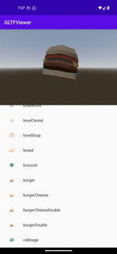

## GLTF Viewer

Sample app showcasing how to integrate and use the Godot Android library to display a set of 
GLTF models rendered by the Godot engine.

Set of GLTFs courtesy of [Kenney Food Kit pack!](https://kenney.nl/assets/food-kit)



### Build & install

Use the following commands to build and install the app:

```
cd Godot-Android-Samples
./gradlew :apps:gltf_viewer:installDebug
```
